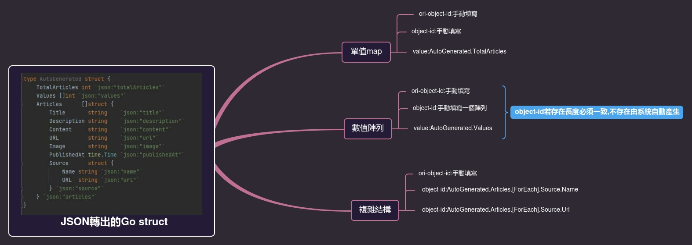
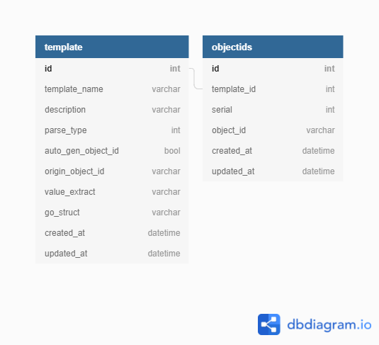

# JsonParser

> UI操作流程
>
> 1. user貼上API response的sample json(這部分後續會改成直接call API)
> 2. 用JS套件產生Golang的structure(可以稍微修飾再show)
> 3. user指定其中key path (取值的邏輯)
> 4. user點擊保存後即開始跑程序(包含存DB與取值)
> 5. 將取到的值於前端呈現, 讓user判斷是否正確
>
> 限制
>
> 1. 目前取值邏輯(key path)僅限存在一個array
> 2. 操作流程中的第二點, JS掃完整個sample如果有發現不一致的子結構, 則無法選擇該結構進key path






```go
// 範例Golang struct
type AutoGenerated struct {
	TotalArticles int `json:"totalArticles"`
	Values []int `json:"values"`
	Articles      []struct {
		Title       string    `json:"title"`
		Description string    `json:"description"`
		Content     string    `json:"content"`
		URL         string    `json:"url"`
		Image       string    `json:"image"`
		PublishedAt time.Time `json:"publishedAt"`
		Source      struct {
			Name string `json:"name"`
			URL  string `json:"url"`
		} `json:"source"`
	} `json:"articles"`	
}
```

## 核心功能

1. DB CRUD

2. 從SQL得到data structure(ex:AutoGenerated), 將前端給的json unmarshal成go struct

3. 從SQL得到user輸入之條件, 據此從go struct取資料並返回

4. 第二與第三會使用eval方式

   

## output template

```json
[
    {
        ori_object_id:"ABC",
        object_id:"abc",
        value:"value"
    },
        {
        ori_object_id:"DEF",
        object_id:"def",
        value:"value"
    },
    ...
]
```


## TODO

- [x] MySQL CRUD

  - 編輯sql腳本於script文件夾內

  - 編輯sqlc.yaml

  - 執行

    ```sh
    sqlc generate
    ```

  - 編輯CRUD go function

    - [x] 若template.AutoGenObjectID is true, 不需建object

- [x] parse邏輯實作

  - 每個template形成一個struct與function
  - function蒐集在一個map裡,key就是template_id
  - 執行時外部送入template_id與payload([]byte),返回result slice
